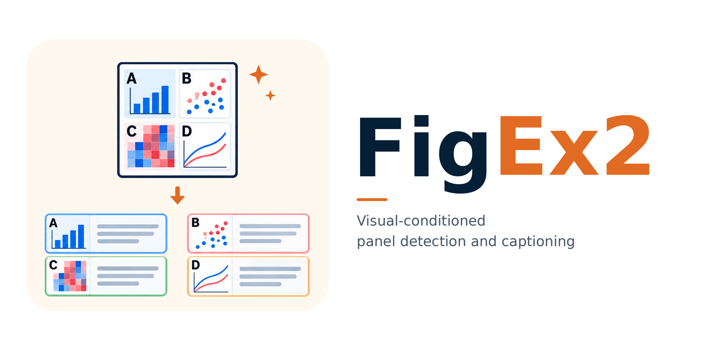

# FigEx2: Visual-Conditioned Panel Detection and Captioning for Scientific Compound Figures

<p align="center">
  
</p>

- [ ] Training code for FigEx2
- [ ] Dataset availability
- [x] Inference code for FigEx2
- [x] Model weights

---

## Model Weights

Download the model weights from [Hugging Face](https://huggingface.co/Huang-AI4Medicine-Lab/FigEx2-8B) and place them under `weights/` as follows:

```text
weights/
├── vlm/
│   └── backbone_adapter/
└── detector/
```

## Test

Install the dependencies:

```bash
pip install -r requirements.txt
```

Run the three included examples:

```bash
bash examples/run_inference.sh
```

Equivalent command:

```bash
python inference.py \
  --test-json examples/input.json \
  --image-root examples/images \
  --peft-dir weights/vlm \
  --dabdetr-dir weights/detector \
  --output-dir results
```

Outputs are written under `results/`.
